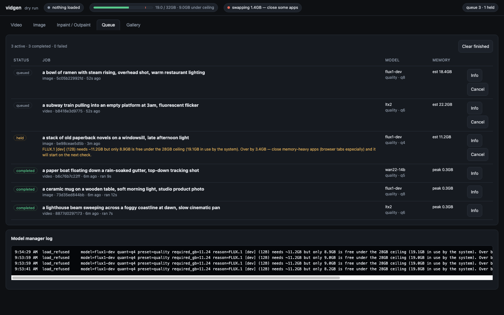
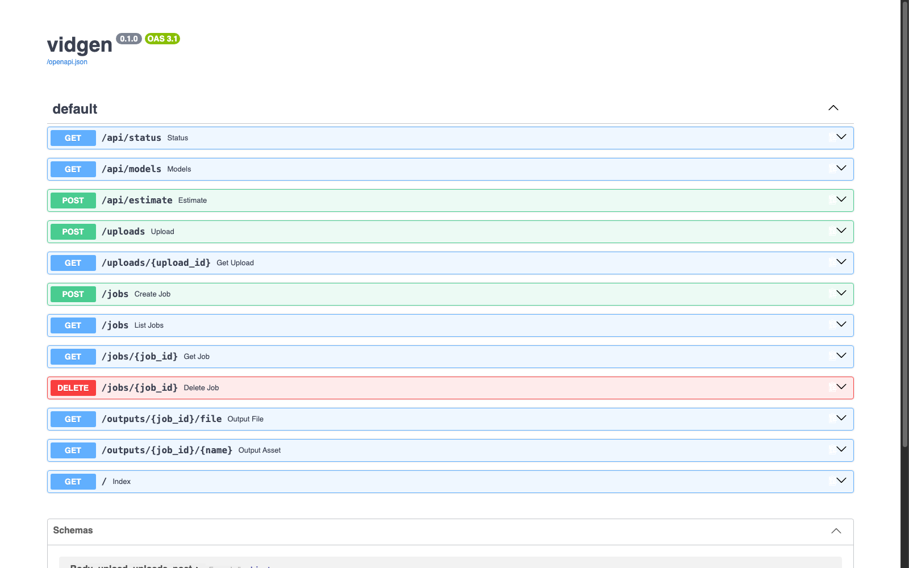

# vidgen

A local job queue and dashboard for running LTX-2.3, Wan2.2 and FLUX.1 on a
32GB Apple Silicon Mac without letting the machine swap itself to death.
Text-to-video, image-to-video, text-to-image and inpainting/outpainting, queued
and browsable from one page.

Fully local: no cloud calls, no telemetry, no accounts. The only network traffic
is the initial model download from Hugging Face, which you can do once and then
run offline.





```
  Video   LTX-2.3 (22B) via mlx-video, Quality / Super-Quality two-stage
          Wan2.2 14B via mlx-video, Q5/Q6 GGUF (alternate engine)
  Image   FLUX.1 [dev] (12B) via mflux, Q8
  Fill    FLUX.1-Fill-dev via mflux, guidance 30 / 25 steps
```

## Why it exists

I wanted to run current video models on a fanless M4 MacBook Air with 32GB of
unified memory. The naive version of this — a script that loads a model and
generates — works exactly once. Queue a second job with a different model and
the machine locks up, because on Apple Silicon there is no separate VRAM pool
to run out of: the GPU allocates from the same 32GB macOS is living in. Cross
that line and you do not get an out-of-memory error, you get the whole Mac
swapping, and a 20-minute render turning into an hour while Finder stops
redrawing.

So the interesting part of this project is not the generation. It is the
admission control that decides whether a job is allowed to start at all.

---

## How it works

Two constraints drive the whole design: 32GB of unified memory shared with
macOS, and no fan.

**One model resident at a time, enforced.** Video and image models here are
14–22B parameters. Two of them resident at once does not fit, and the failure
mode is not a clean error — it is macOS quietly swapping, which on unified
memory collapses generation speed. So the queue is strictly sequential, and the
model manager unloads the current model *before* it evaluates whether the next
one can load. An immediate LTX-2.3 → FLUX.1 [dev] switch never holds both.

**Runners are child processes.** "Unloading" a model inside a long-lived Python
process means dropping references and hoping the Metal allocator gives the pool
back. It largely does not, and fragmentation compounds across jobs. Running each
render in a child process makes unloading an OS-level guarantee: the process
exits, every buffer is freed. The model manager owns the policy; the subprocess
is the mechanism. It also means a wedged render can be killed without taking the
service down.

**A hard headroom guard at ~28GB.** Before any load, vidgen reads the real
unified-memory state — `psutil` if present, otherwise `sysctl hw.memsize` plus
`vm_stat`, counting free + speculative + purgeable + file-backed pages as what
an allocation can actually take — and compares `in use + estimated peak for this
job + 1GB margin` against a 28GB ceiling, leaving ~4GB for macOS. The estimate
comes from a per-model, per-quantization, per-preset footprint table plus a
latent/VAE overhead term that scales with resolution and frame count.

Three outcomes, and the distinction between them is the point:

- Fits now → load and run.
- Does not fit *right now*, but could → the job is **held** in the queue with a
  plain-language reason ("over by 3.2GB — close browser tabs") and re-checked on
  a timer. It is not failed.
- Could never fit on this machine at any point — LTX-2.3 at Q8, say — → rejected
  at submit time, with a suggestion of what to change.

If the memory probe itself fails, the guard refuses rather than loading blind.

**Quantization is a quality decision, not a convenience one.** The defaults are
the highest-quality option that fits: Q8 for FLUX (near-indistinguishable from
full precision), Q6 for LTX-2.3, Q5 for Wan2.2. Q4 is selectable everywhere and
recommended nowhere.

---

## Requirements

- Apple Silicon Mac, macOS 14+
- Python 3.11+
- ~120GB free disk if you download all four model families
- `ffmpeg` (optional, only used by the dry-run stub renderer): `brew install ffmpeg`

## Install

```bash
./scripts/setup.sh            # creates .venv, installs the service + both model stacks
WITH_MODELS=0 ./scripts/setup.sh   # service only; the dashboard runs in dry-run mode
cp .env.example .env          # setup.sh does this for you if .env is absent
```

The model stacks are `mlx-video` (LTX-2.3, Wan2.2) and `mflux` (FLUX.1 dev and
Fill). Nothing in the code hardcodes a path — `.env` controls the model cache
directory, output directory, port and every memory threshold. `.env.example` is
the annotated list.

## Model downloads

Weights are fetched on first use into `VIDGEN_MODEL_CACHE_DIR` (default
`~/.cache/huggingface`). The first run of each model is slow; afterwards
everything is local. The gotchas, one per family:

- **LTX-2.3** (default video engine, ~22B) needs an *MLX-converted* repo, not
  the original weights. mlx-video's conversions live under `prince-canuma/LTX-2-*`;
  `hf download prince-canuma/LTX-2-dev`, then set `VIDGEN_LTX_MODEL_REPO`.
  Quantization is applied at load time and is mandatory, not optional — full
  precision does not fit alongside macOS.
- **Wan2.2** (alternate video engine) wants the **14B** T2V/I2V weights, not the
  5B or 1.3B variants, at **Q5 or Q6** GGUF. Q4 has visible quality loss. Point
  `VIDGEN_WAN_MODEL_DIR` at the directory; Wan jobs fail with a clear message
  until you do.
- **FLUX.1 [dev]** and **FLUX.1-Fill-dev** are gated repos — accept the license
  on each model page and `hf auth login` once. mflux resolves them from the HF
  cache; `VIDGEN_FLUX_DEV_PATH` / `VIDGEN_FLUX_FILL_PATH` override with a local
  directory.

## Run

```bash
./scripts/vidgen.sh start      # start in the background
./scripts/vidgen.sh status     # pid + live memory/queue state
./scripts/vidgen.sh logs       # tail the log
./scripts/vidgen.sh stop
./scripts/vidgen.sh restart
```

Then open **http://127.0.0.1:8817**.

To run it at login as a launchd agent (the plist is generated from your actual
paths, not a checked-in template):

```bash
./scripts/vidgen.sh install     # writes ~/Library/LaunchAgents/com.vidgen.server.plist
./scripts/vidgen.sh uninstall
```

### Try it without any weights

```bash
VIDGEN_DRY_RUN=1 ./scripts/vidgen.sh restart
```

Dry-run mode swaps in a stub renderer that really runs as a subprocess, really
allocates memory, really reports progress and really writes an output file —
so the queue, the guard, the gallery and the mask editor all work end to end
before you have downloaded 60GB of weights.

---

## Using it

Four tabs — Video, Image, Inpaint/Outpaint, Gallery — plus a Queue view. The
header is always visible and always shows the resident model, unified memory
used against the ceiling, and a warning if the system has started swapping.

Video takes a prompt, engine, preset, quantization, size, duration and seed,
plus an optional start image which turns the job into image-to-video. Frame
counts snap to 8n+1 and dimensions to multiples of 64 because both engines
require it; the server rounds rather than rejecting.

| Preset | LTX-2.3 pipeline | What it does |
| --- | --- | --- |
| Fast | `distilled` | Single distilled pass. Present for comparison; not the default. |
| **Quality** | `dev-two-stage` | Guided half-res pass → 2× latent upscale → distilled refine. **Default.** |
| Super-Quality | `dev-two-stage-hq` | Same path at higher guidance and full refine. Slowest, best. |

Inpaint/Outpaint has a brush-based mask editor (paint/erase/invert/clear) and a
before/after comparison. White regenerates, black keeps, matching what
FLUX.1-Fill expects. Outpainting is the same operation: set margins, hit **Apply
margins**, and the new canvas area is pre-filled into the mask.

The Queue view shows every job with live progress, the reason any job is being
held, and the model manager's log of what loaded, what unloaded, and how much
memory came back.

---

## API

Everything the dashboard does is a plain HTTP call.

```
POST   /jobs               queue a job
GET    /jobs               list jobs         ?status=&type=&model=&limit=
GET    /jobs/{id}          one job, with meta.json inlined when finished
DELETE /jobs/{id}          cancel if active, delete (and purge files) if finished

POST   /uploads            multipart image upload -> {id}, for i2v / inpaint
GET    /outputs/{id}/file  the render        ?download=true
GET    /outputs/{id}/meta.json

GET    /api/status         resident model, memory, queue counts, event log
GET    /api/models         model + preset + quantization catalog
POST   /api/estimate       what a job would cost, and whether it fits right now
```

`POST /jobs` takes a unified body with a `type` discriminator:

```bash
# text-to-video, Super-Quality
curl -X POST localhost:8817/jobs -H 'Content-Type: application/json' -d '{
  "type": "video",
  "prompt": "A lighthouse in heavy fog, slow push-in, anamorphic",
  "model": "ltx2", "preset": "super-quality", "quant": "q6",
  "width": 768, "height": 512, "duration_seconds": 4, "fps": 24, "seed": 7
}'

# image-to-video: the same call plus a source_image upload id
curl -X POST localhost:8817/uploads -F file=@still.png     # -> {"id": "...png"}
```

`type` is `"image"` or `"inpaint"` for the other two; inpaint additionally takes
`source_image` and `mask_image` upload ids.

Every finished job writes `outputs/<job_id>/`:

```
output.mp4  |  output.png     the render
meta.json                     prompt, model, preset, quant, seed, resolution,
                              the exact command that was run, timestamps, and
                              resolved memory usage — estimated peak, observed
                              peak RSS, ceiling, and system state at start
run.log                       full runner stdout/stderr
source.png, mask.png          inpaint jobs only, so before/after survives cleanup
```

Observed peaks are also accumulated in `data/observed_footprints.json`. If your
real numbers drift from the built-in estimates, write the corrections into
`data/model_footprints.json` (`{"ltx2:super-quality:q6": 23.5}`) and the guard
uses yours.

---

## Operating notes for a fanless machine

**This Mac has no fan.** Sustained GPU load raises the chassis temperature until
macOS reduces clocks — there is no way to cool it back down while work
continues. Practical consequences:

- **Expect a long session to slow down, not to hold peak speed.** The first
  Super-Quality LTX-2.3 render of the evening is the fastest one you will get.
  Back-to-back Super-Quality or Fill runs will progressively throttle; a job
  that took 18 minutes cold can take noticeably longer as the third or fourth in
  a row. This is normal and is not a bug in the queue.
- **If you need consistent timings** — comparing two prompts or two seeds, say —
  leave a few minutes between runs rather than queueing them back to back.
- **Quality-first defaults are slow by design.** The two-stage path exists
  precisely because it produces better output than the distilled one. Queue it
  and walk away; that is the intended workflow, and the reason the whole thing
  is a queue rather than a synchronous call.
- **Close memory-heavy apps before a big render, browser tabs above all.** A
  browser with many tabs open can easily hold 4–8GB, which is the difference
  between LTX-2.3 at Q6 fitting under the 28GB ceiling and being held. The
  dashboard header shows exactly how much room is left; if a job is held, the
  message tells you how many GB you need to free.
- **Never let it swap.** If the header shows a swap warning, stop queueing and
  free memory. Swapping unified memory does not degrade performance gracefully
  — it falls off a cliff. The guard exists to prevent this, but it can only
  control vidgen's own allocations, not what else you have open.

---

## Troubleshooting

**"needs ~X GB but only Y GB is free under the ceiling"** — working as intended.
Close some apps, or lower resolution / frame count / quantization. The job stays
held and starts on its own once there is room.

**"…which alone exceeds the 28GB ceiling"** — that combination can never run on
this machine. Step the quantization down (Q6 for LTX-2.3, not Q8) or shrink the
output.

**A runner exits with an unrecognized-argument error.** The upstream CLIs move
fast. Rather than patching code, adapt with the escape hatches in `.env`:
`VIDGEN_LTX_EXTRA_ARGS`, `VIDGEN_WAN_EXTRA_ARGS`, `VIDGEN_MFLUX_EXTRA_ARGS`,
`VIDGEN_MFLUX_FILL_EXTRA_ARGS` are appended verbatim, and
`VIDGEN_MLX_VIDEO_QUANT_FLAG` renames the quantization flag. Check
`outputs/<job_id>/run.log` for the failure and the exact command in `meta.json`.

**`mflux-generate: not found`** — the service is running from a different
interpreter than the one mflux was installed into. Set `VIDGEN_PYTHON` to the
venv's python, or `VIDGEN_MFLUX_GENERATE` to the binary's absolute path.

**Jobs marked "Service restarted while this job was running."** — expected after
a crash or restart mid-render. Renders are not resumable; resubmit.

**Gated-repo 401s from Hugging Face** — accept the license for FLUX.1-dev and
FLUX.1-Fill-dev on their model pages, then `hf auth login`.

## Status

Working prototype that I use. Honest limits:

- **Tested on one machine**, an M4 Air with 32GB. The ceiling defaults assume
  that shape. On a 64GB or 128GB Mac you would raise `VIDGEN_MEMORY_CEILING_GB`
  and most of the holding behaviour stops mattering.
- **The footprint estimates are hand-measured**, not derived. They are good
  enough to keep the guard on the right side of the line, but a job can still
  hold when it would in fact have fit, or overshoot its estimate under an
  unusual resolution. Observed peaks are logged so you can correct them; nothing
  corrects them automatically.
- **The LTX-2.3 and FLUX paths are the ones I actually run.** The Wan2.2 runner
  is implemented and the argument construction is tested, but I have generated
  far less with it, so treat it as the less-worn path.
- **The upstream CLIs move fast.** mlx-video and mflux rename flags between
  releases; that is why every runner has a verbatim extra-args escape hatch
  rather than me chasing renames in code.
- **No CI.** Tests run locally with `python -m pytest -q` (25 tests). They cover
  the headroom guard and the single-active-model invariant against a faked
  memory probe, and drive the whole API against the stub renderer — so the suite
  runs on any machine, with no GPU and no weights on disk.
- Renders are not resumable. A restart mid-job loses the job.

## Layout

```
vidgen/
  config.py          env-driven configuration, no hardcoded paths
  memory.py          unified-memory probing (psutil -> vm_stat -> /proc)
  models.py          model/preset/quant registry + peak-footprint estimator
  model_manager.py   single-active-model policy, headroom guard, subprocess exec
  db.py              SQLite job store (WAL)
  worker.py          single-worker sequential queue
  schemas.py         request validation + parameter resolution
  runners/           mlx-video (LTX, Wan) and mflux (generate, fill) adapters
  static/index.html  the dashboard, single file
scripts/             setup.sh, vidgen.sh (start/stop/install)
tests/               memory-guard and API tests
```

## License

MIT. See [LICENSE](LICENSE).
